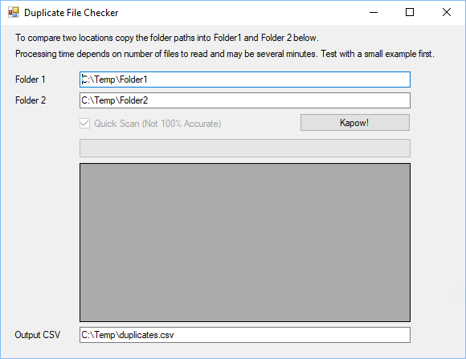

# Duplicate File Checker

Windows Forms app to scan two folders and produce CSV list of suspected duplicates, optionally using file content hash.

This was built in 2011 but still works fine, it was never very refined but it can handle a large set of files. Could do with some UI refinements.

